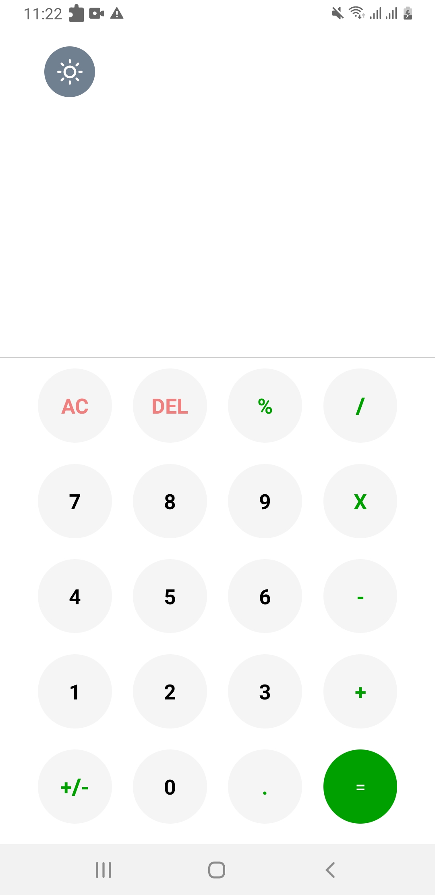
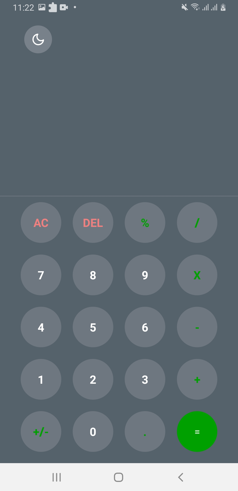
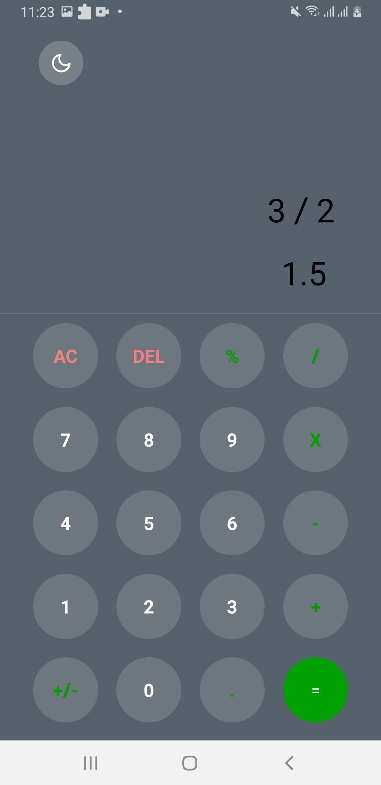
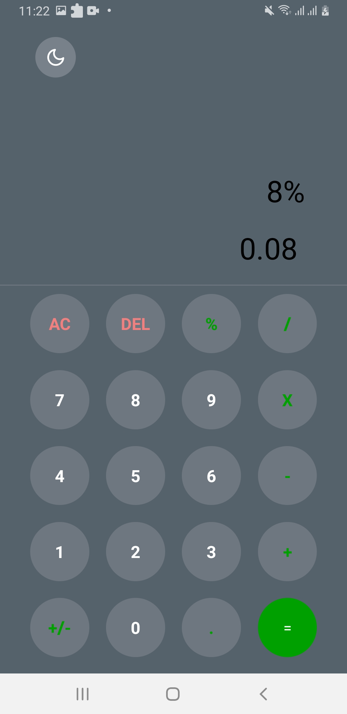
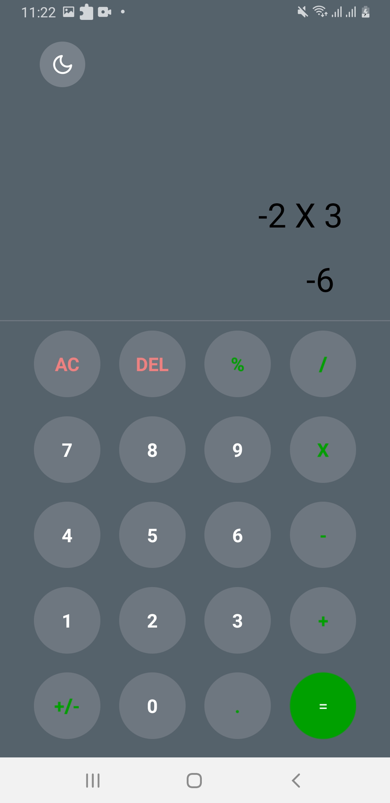

# Calculadora
 
### Olá! Eu sou Danielle Torres 👋

### Criei uma calculadora simples com o intuito de aprimorar meus conhecimentos.
### Seguem abaixo as imagens do aplicativo Calculadora: 

 

    
    
     
    
    
       

    <video width="320" height="240" controls>
    <source src="./src/videos/calculator.mp4" type="video/mp4">
    Your browser does not support the video tag.
    </video>

### Tecnologia utilizada

     

